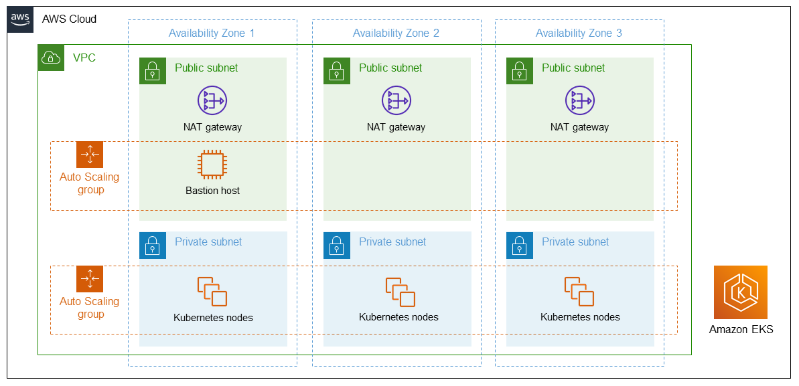

## Deprecation Notice

:x: This repository is subject to deprecation in Q4 2024. For more details, [please review this announcement](https://github.com/aws-ia/.announcements/issues/1).


## CloudFormation Base EKS

This Reference Architecture is designed to be used by AWS Marketplace, as a base for EKS related items. See the SUBMODULE_README.md for how to properly use it.

<h2>Architecture</h2>

Deploying this reference architecture with default parameters builds the following Amazon EKS environment in the
AWS Cloud.




The reference architecture sets up the following:

* A highly available architecture that spans three Availability Zones.*
* A VPC configured with public and private subnets, according to AWS best practices, to provide you with your own virtual network on AWS.*
* In the public subnets, managed NAT gateways to allow outbound internet access for resources in the private subnets.*
* In one public subnet, a Linux bastion host in an Auto Scaling group to allow inbound Secure Shell (SSH) access to Amazon Elastic Compute Cloud (Amazon EC2) instances in private subnets. The bastion host is also configured with the Kubernetes `kubectl` command line interface (CLI) for managing the Kubernetes cluster.
* An Amazon EKS cluster, which creates the Kubernetes control plane.
* In the private subnets, a group of Kubernetes nodes.

+++*+++ The template that deploys the Quick Start into an existing VPC skips the components marked by asterisks and prompts you for your existing VPC configuration.


<h2>Specialized knowledge</h2>

This deployment requires a moderate level of familiarity with
AWS services. If you’re new to AWS, see [Getting Started Resource Center](https://aws.amazon.com/getting-started)
and [AWS Training and Certification](https://aws.amazon.com/training). These sites provide materials for learning how to design,

<h3>AWS account****</h3>

If you don’t already have an AWS account, create one at https://aws.amazon.com by following the on-screen instructions. Part of the sign-up process involves receiving a phone call and entering a PIN using the phone keypad.

Your AWS account is automatically signed up for all AWS services. You are charged only for the services you use.


<h3>Technical requirements</h3>

Before you launch the reference architecture, review the following information and ensure that your account is properly configured. Otherwise, deployment might fail.


<h3>IAM permissions</h3>

Before launching the reference architecture, you must sign in to the AWS Management Console with IAM permissions for the resources that the templates deploy. The _AdministratorAccess_ managed policy within IAM provides sufficient permissions, although your organization may choose to use a custom policy with more restrictions. For more information, see [AWS managed policies for job functions](https://docs.aws.amazon.com/IAM/latest/UserGuide/access_policies_job-functions.html).


<h2>Test the deployment</h2>

NOTE: These steps must be executed from a network that has access to the Kubernetes API, as configured by the *EKS public access endpoint* and *Kubernetes API public access CIDR* parameters. For more information, see [Installing kubectl](https://docs.aws.amazon.com/eks/latest/userguide/install-kubectl.html). If you enabled the optional bastion host, you can connect to it by using SSH. Use the key pair that you specified during deployment and the IP address from the *Outputs* tab of the AWS CloudFormation stack.

The bastion host already has `kubectl` installed and configured so that it connects to the cluster. To test the CLI, connect to the cluster, and run the following command.

```
$ kubectl version
```

Confirm that the output includes the server version, which indicates a successful connection to the Kubernetes control plane.

```
Client Version: version.Info\{Major:"1", Minor:"11", GitVersion:"<version number>", GitCommit:"<commit ID>", GitTreeState:"clean", BuildDate:"2018-12-06T01:33:57Z", GoVersion:"go1.10.3", Compiler:"gc", Platform:"linux/amd64"}

Server Version: version.Info\{Major:"1", Minor:"11+", GitVersion:" <version number>", GitCommit:" <commit ID>", GitTreeState:"clean", BuildDate:"2018-12-06T23:13:14Z", GoVersion:"go1.10.3", Compiler:"gc", Platform:"linux/amd64"}
```

[start=3]
. Check for a successful connection between the nodes and cluster by running the `get nodes` command.

```
$ kubectl get nodes
NAME STATUS ROLES AGE VERSION
ip-10-0-25-239.us-west-2.compute.internal Ready <none> 10m <version number>
ip-10-0-27-244.us-west-2.compute.internal Ready <none> 10m <version number>
ip-10-0-35-29.us-west-2.compute.internal Ready <none> 10m <version number>
```

<h2>Best practices for using Amazon EKS</h2>

<h3>Use AWS CloudFormation for ongoing management</h2>

We recommend using AWS CloudFormation for managing updates and resources that are created by this reference architecture.
Using the Amazon EC2 console, CLI, or API to change or delete resources can cause future AWS
CloudFormation operations on the stack to behave unexpectedly.

<h3>Monitor additional resource usage</h3>

This deployment enables users of the Amazon EKS cluster to create elastic load balancers and Amazon EBS volumes
as part of their Kubernetes applications. Because these carry additional costs, we recommend that you grant users of the
Amazon EKS cluster the minimum permissions required according to [Kubernetes Role Based Access Control (RBAC)](https://kubernetes.io/docs/reference/access-authn-authz/rbac) and that you monitor resource usage by using the Kubernetes CLI or API to describe persistent
volume claims (PVC) and `LoadBalancer` resources across all namespaces. To disable this functionality, update the
`ControlPlaneRole` IAM role in the child stack to restrict access to the Kubernetes control plane for specific AWS
APIs, such as `ec2:CreateVolume` and `elb:CreateLoadBalancer`.

<h3>Security</h3>

Amazon EKS uses AWS IAM to authenticate your Kubernetes cluster, but it still relies on native Kubernetes RBAC. This means that IAM is used only for valid entities. All permissions for interacting with your Amazon EKS cluster’s Kubernetes API are
managed by the native Kubernetes RBAC system. We recommend that you grant least-privilege access via Kubernetes RBAC.

<h3>Adding Kubernetes users</h3>

This reference architecture creates an IAM role that is used to create the Kubernetes control plane. The AWS CloudFormation custom
resources and Linux bastion host use the IAM role to provide access to the Kubernetes API. Additional IAM users or
roles can be added as Kubernetes administrators (**system:master** kubernetes cluster role) by entering an ARN into the
**Additional EKS admin ARN** parameter when you launch this Quick Start. To add users after the stack launches, see [Managing users or IAM roles for your cluster](https://docs.aws.amazon.com/eks/latest/userguide/add-user-role.html).

<h3>Managing Kubernetes resources using AWS CloudFormation</h3>

This reference architecture includes AWS CloudFormation registry types that enable authoring, creating, and
managing Kubernetes-based applications. For an example, see [example-workload template](https://github.com/aws-ia/cloudformation-base-eks/blob/main/templates/examples/example-workload.template.yaml).


<h2>Optional add-ins</h2>

This reference architecture contains optional configurations and add-ins for Kubernetes that enhance the functionality and reduce post-deployment configuration tasks for customers.

<h3>Cluster autoscaler</h3>

[Cluster autoscaler](https://github.com/kubernetes/autoscaler/tree/master/cluster-autoscaler) automatically adjusts the
size of the Kubernetes cluster when there are insufficient resources or nodes.

<h3>Managed node group</h3>

With Amazon EKS–managed node groups, provisioning and lifecycle management of the nodes is automated. All nodes get
provisioned as part of an Auto Scaling group, which means you cannot use the *Cluster autoscaler* option. Nodes are created using the latest Amazon EKS–optimized Amazon Linux 2 AMI.

<h3>EFS `StorageClass`</h3>

An optional `EFSStorageClass` volume provides redundant, persistent storage that is untethered to individual Availability
Zones, so it is well suited for high availability, stateful applications that are required to survive an outage. The Amazon EFS volume is available to Kubernetes pods through the
[EFS provisioner project](https://github.com/helm/charts/tree/master/stable/efs-provisioner).

There are several configuration options available to tune the performance and throughput of the underlying EFS volume.
For more information, see [Amazon EFS Performance](https://docs.aws.amazon.com/efs/latest/ug/performance.html).