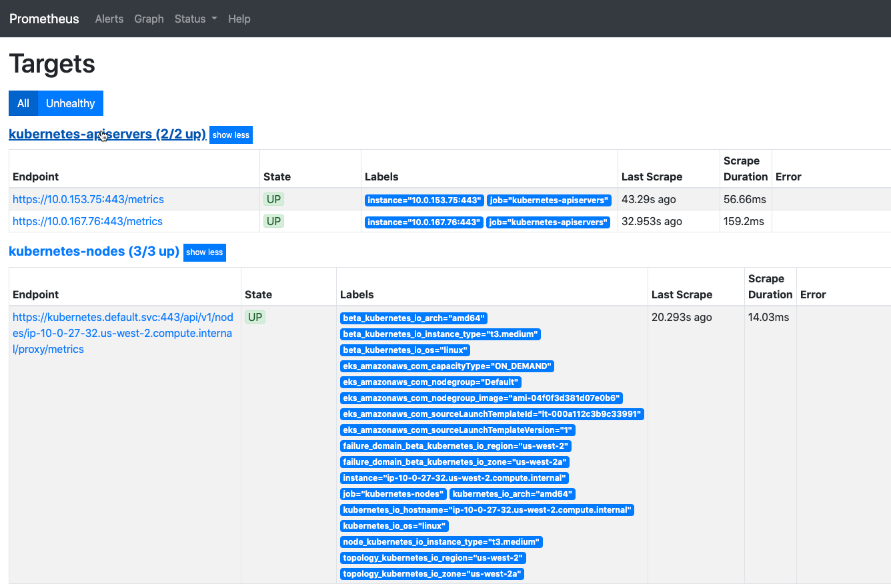

== Test the deployment

NOTE: Test from a network with access to the Kubernetes API, as configured by the *Amazon EKS public access endpoint* and *Kubernetes API public access CIDR* parameters. For more information, see https://docs.aws.amazon.com/eks/latest/userguide/install-kubectl.html[Installing kubectl^]. If you enabled the optional bastion host, you can connect to it using SSH (Secure Shell). Use the key pair that you specified during deployment and the IP address from the *Outputs* tab of the AWS CloudFormation stack. The bastion host already has Kubectl installed and configured so that it connects to the cluster. To test the CLI, connect to the cluster, and run the following command.

. Configure the Kubectl command line utility to connect to your Amazon EKS cluster according to https://docs.aws.amazon.com/eks/latest/userguide/managing-auth.html[Cluster authentication^].
. Set up proxy traffic to the Prometheus server by running the following command:
```
kubectl port-forward -n prometheus sts/prometheus-server 8080:9090
```
[start=3]
:xrefstyle: short
. Navigate to `http://localhost:8080/targets/` in your web browser. You should see a page like the one shown in <<web-ui1>>:

[#web-ui1]
.Prometheus web interface
[link=images/web_interface.png]


== Best practices for using {partner-product-short-name} on EKS
Best practices for alerting, naming, instrumentation, and more can be found in the https://prometheus.io/docs/practices/naming/[Prometheus documentation^].

== Security
Prometheus contains many components and integrations with other systems, and some configurations may enable additional attack vectors. For more information, see the https://prometheus.io/docs/operating/security/#security-model[Prometheus security model^].

== Deployment customization
To customize the Quick Start, you can create a file with custom values. During stack deployment, enter the file URI in the *Override values* parameter. The file must be in YAML format and placed in a public HTTPS location or an S3 bucket. If you use an S3 bucket, ensure that the AWS Identity and Access Management (IAM) role `awsqs-kubernetes-helm` has read permissions to the file. For a list of configurable options, see the https://github.com/prometheus-community/helm-charts/blob/main/charts/prometheus/values.yaml[prometheus-community/helm-charts] GitHub page.


== Scalability
By default, this deployment uses General Purpose SSD (gp2) volumes for storage. Large deployments may need more I/O performance or storage space. To increase I/O performance, provide a custom-values file to point the Prometheus server disk to a `StorageClass` with IOPS provisioned by Amazon EBS. To increase storage size, set `server.persistentVolume.size` and `alertmanager.persistentVolume.size` parameters in your custom-values file.
