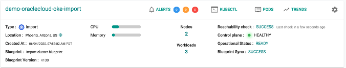

// Add steps as necessary for accessing the software, post-configuration, and testing. Don’t include full usage instructions for your software, but add links to your product documentation for that information.
//Should any sections not be applicable, remove them #

== Test the deployment
// If steps are required to test the deployment, add them here. If not, remove the heading
1.	Log in to the Rafay console. New Rafay customers will receive an email with a user name, password, and link to the Rafay console.
2.	For details about the newly imported cluster, as shown in the following figure, navigate to *Infrastructure* and then *Clusters*.

[#testing1]
.Imported cluster information {partner-product-short-name} on AWS

//== Post deployment steps
// If Post-deployment steps are required, add them here. If not, remove the heading

== Best practices for using {partner-product-short-name} on AWS
// Provide post-deployment best practices for using the technology on AWS, including considerations such as migrating data, backups, ensuring high performance, high availability, etc. Link to software documentation for detailed information.

For more information, see https://docs.rafay.co/[Rafay's documentation^].

== Security
// Provide post-deployment best practices for using the technology on AWS, including considerations such as migrating data, backups, ensuring high performance, high availability, etc. Link to software documentation for detailed information.

The following are important considerations related to the Rafay Systems KOP:

* Roles-based access control and Amazon IAM.

* You can automate the provisioning and lifecycle management of Amazon EKS clusters in all supported AWS Regions.

* With auto provisioning, you can deploy a cluster in moments. In order to do this, you must provide credentials that allow programmatic access to Amazon AWS.

* Two types of credentials are supported: IAM role and IAM user. For more information about how to create and configure KOP credentials, see the https://docs.rafay.co/clusters/provision/eks/credentials/[KOP documentation^].

=== Email allow listing

A third-party service is used for emails sent by Rafay KOP (for example, for first-time user activation, password resets, and notifications). If users in your organization are not receiving these emails, we recommend allow listing the sender’s IP. The dedicated IP address used for sending emails by KOP is `149.72.39.92`.

=== Network firewall rules

The Rafay controller is designed for customers to deploy and manage clusters in both public and on-premises environments. To onboard an on-premises or cloud-based cluster  for ongoing operations and lifecycle management, ensure the following:

* A Kubernetes operator is installed on each managed cluster. This establishes and maintains an outbound TLS-based control channel for the Rafay controller, which is hosted on AWS for SaaS.
* No inbound ports should be open on the customer's external firewall for Rafay control-plane traffic.

The Rafay Kubernetes operator uses only `TCP Port 443, Outbound` to communicate with the Rafay controller.

=== Controller details

For greater control over IP connectivity between EKS clusters and KOP, customers can add relevant IP addresses and fully qualified domain names to their firewalls or security groups. This helps to ensure that outbound connectivity is allowed only for specified IPs. For more information, see https://docs.rafay.co/security/overview/[Rafay's security overview^].

== Other useful information
//Provide any other information of interest to users, especially focusing on areas where AWS or cloud usage differs from on-premises usage.

*{partner-product-short-name}*

* https://docs.rafay.co/[Rafay KOP documentation^]

*AWS resources*

* https://aws.amazon.com/getting-started/[Getting Started with AWS^]
* https://docs.aws.amazon.com/general/latest/gr/[AWS General Reference^]
* https://docs.aws.amazon.com/general/latest/gr/glos-chap.html[AWS glossary^]
* https://docs.aws.amazon.com/cloudformation/[AWS CloudFormation documentation^]
* https://docs.aws.amazon.com/AWSEC2/latest/UserGuide/AmazonEBS.html[Amazon Elastic Block Store (Amazon EBS)^]
* https://docs.aws.amazon.com/ec2/[Amazon Elastic Compute Cloud documentation^]
* https://docs.aws.amazon.com/iam/[AWS Identity and Access Management Documentation^]
* https://docs.aws.amazon.com/vpc/[Amazon Virtual Private Cloud Documentation^]
